import { Badge } from "@astrojs/starlight/components";
import { Card, CardGrid } from "@astrojs/starlight/components";
import { Tabs, TabItem } from "@astrojs/starlight/components";
import { Icon } from "@astrojs/starlight/components";
import { LinkCard } from '@astrojs/starlight/components';
import { Steps } from '@astrojs/starlight/components';

# Automate Captcha Solving with NoCaptcha AI Browser Extension

  

    Say goodbye to frustrating CAPTCHA challenges with noCaptchaAI browser
    extension. This guide will walk you through the steps to hardcode your api
    key Like, Share & Subscribe.{" "}
    <Badge text="note" variant="note">
      3 minutes read
    </Badge>
  

  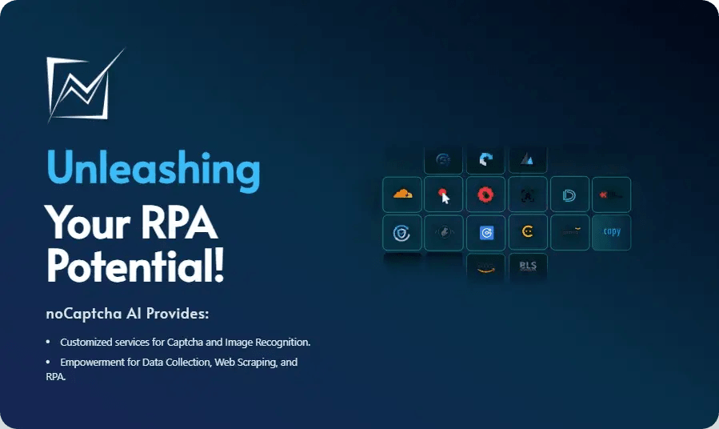

## Introduction to noCaptcha AI

<Card title="About the Service">
  NoCaptcha AI is an AI-powered service designed to automatically solve CAPTCHA challenges, including:

 <Steps>
  1.  reCAPTCHA v2 (Image & Audio)
  2.  BLS CAPTCHA 
  3.  ImageToText OCR
  4.  AWS Captca
</Steps>
  and more...

It offers browser extensions compatible with Chrome and Firefox, enabling users to bypass CAPTCHAs effortlessly.

</Card>

## Setting Up Your noCaptcha AI Account

<CardGrid stagger>
  <Card title="Step 1" icon="rocket">
    <Badge text="Account Creation" variant="success" />
    Visit the NoCaptcha AI Dashboard then tap on Sign up to create your account for free.

    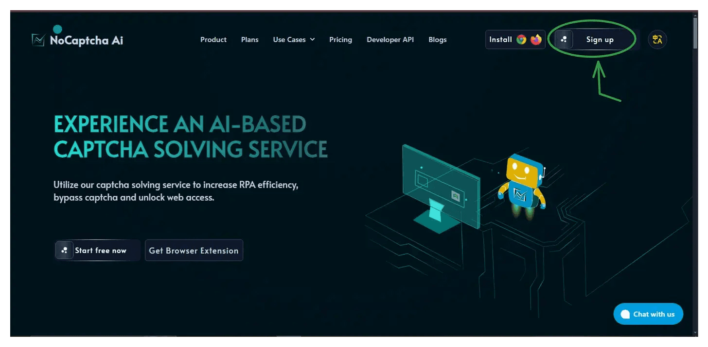
  </Card>

{" "}

<Card title="Step 2" icon="setting">
  <Badge text="Login" variant="success" />
  Log in to your account now to obtain your unique API key. 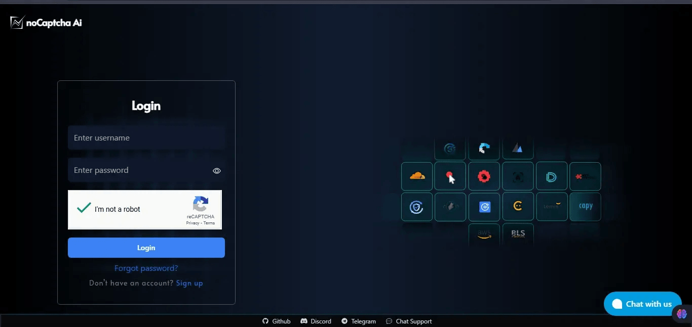
</Card>

  <Card title="Step 3" icon="key">
    <Badge text="API Key" variant="success" />
    Copy the API key provided in your dashboard.
    
        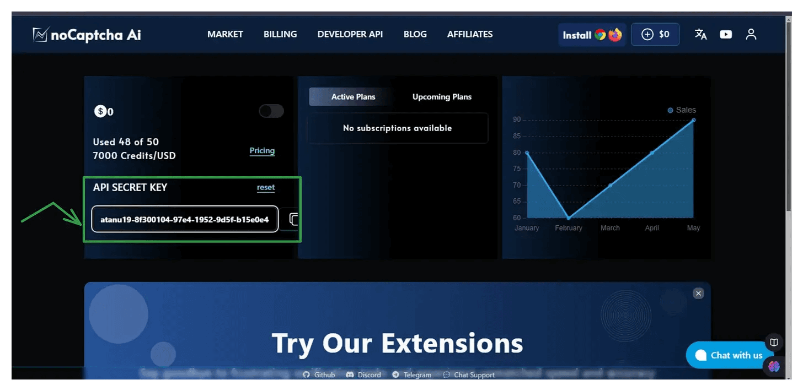
  </Card>
</CardGrid>

## Installing the Browser Extension

<Tabs>
  <TabItem label="Chrome Installation">
    ### For Chrome Users
 
    1. Visit the NoCaptcha AI Chrome Extension <a href="https://github.com/noCaptchaAi/NoCaptcha-Ai-Browser-Extension">GitHub</a> page:
     
    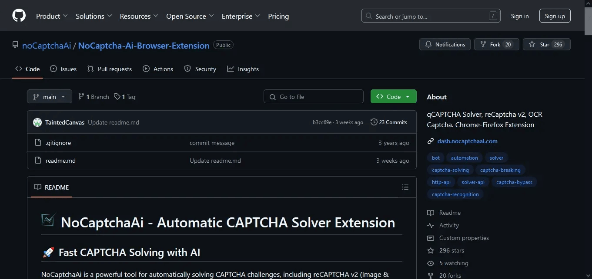
    
    2. Download the latest CRX/ZIP file:
     
      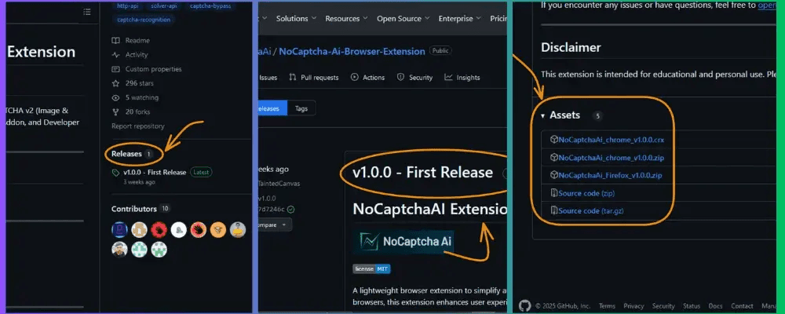
    
    3. Navigate to chrome://extensions:
      
      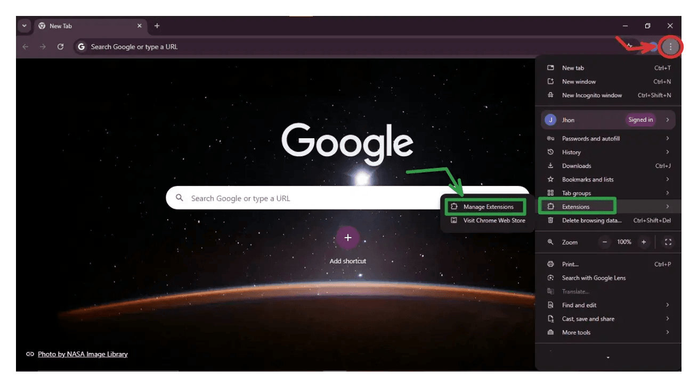
    
    4. Enable Developer Mode:
     
     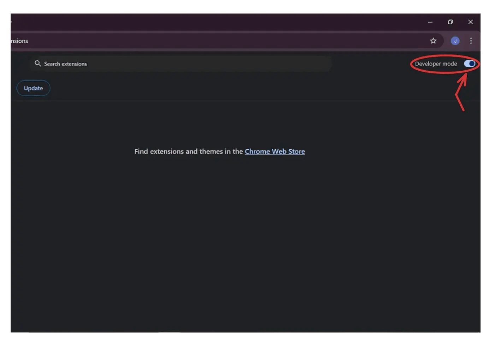
    
    5. Follow the configuration steps as shown in previous images
  </TabItem>

  <TabItem label="Firefox Installation">
    ### For Firefox Users
    
    1. Visit the NoCaptcha AI <a href="https://github.com/noCaptchaAi/NoCaptcha-Ai-Browser-Extension">GitHub repository</a>:
    
    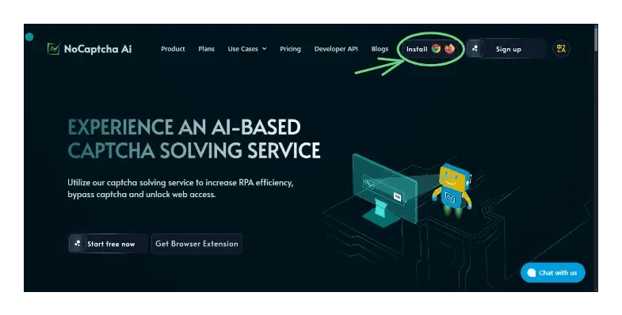

    2. Download the latest Firefox addon:

     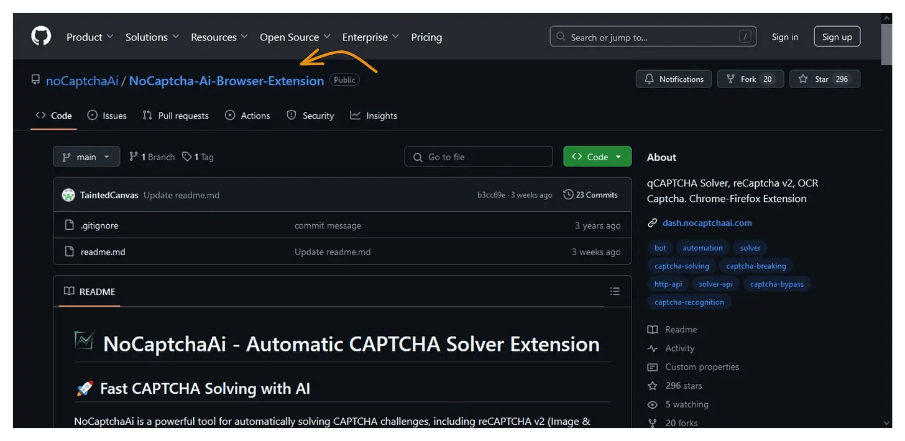

    3. Install the addon:

    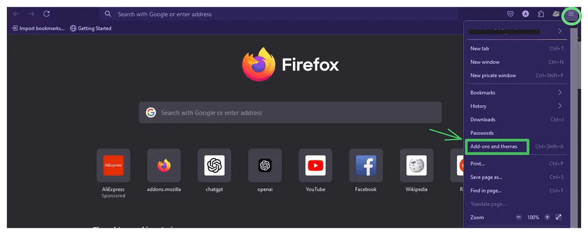

    4. Configure the extension:

     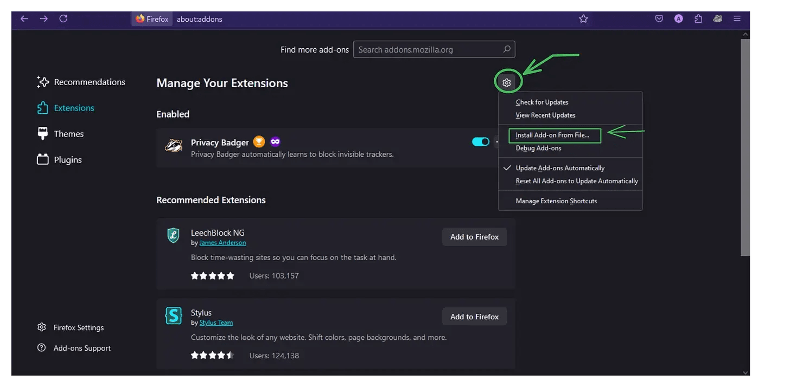

  </TabItem>
</Tabs>

## Configuration Guide

<Card title="Extension Setup">
  <Steps>
  1.  Click the extension icon in your browser's toolbar 
  2.  Paste your API key in the settings 
  3.  Configure your preferences 
  4.  Start using the automated CAPTCHA solving
</Steps>
</Card>

## Usage and Management

<CardGrid>
  <Card title="Dashboard Access" icon="open-book">
    Monitor your usage statistics at:
    https://nocaptchaai.com
  </Card>

  <Card title="Free Plan" icon="star">
    Includes  6000  solves per month
    Upgrade options available for higher usage
  </Card>
</CardGrid>

## Support and Resources

<Card title="Need Help?">

<LinkCard title="Refer to NoCaptcha AI Documentation" href="/guides/authoring-content/" />
<LinkCard title="Join our GitHub community" href="/guides/authoring-content/" />
<LinkCard title="Check FAQs and troubleshooting guides" href="/guides/authoring-content/" />
</Card>

## Related Resources

  <Card title="Further Reading">
    <ul>
      <li style={{ listStyle: "disc", marginLeft: "1em" }}>
        <a href="https://substack.com/home/post/p-154869848?r=536fdg">
          Effortlessly Bypass CAPTCHAs with noCaptcha Ai.
        </a>
      </li>
      <li style={{ listStyle: "disc", marginLeft: "1em" }}>
        <a href="https://substack.com/home/post/p-154935538?r=536fdg">
          Bypassing reCAPTCHA with Playwright .
        </a>{" "}
      </li>
     
    </ul>
  </Card>
