# Automate Captcha Solving with NoCaptcha AI Browser Extension

Say goodbye to frustrating CAPTCHA challenges with noCaptchaAI browser extension. This guide will walk you through the steps to hardcode your api key Like, Share & Subscribe.3 minutes

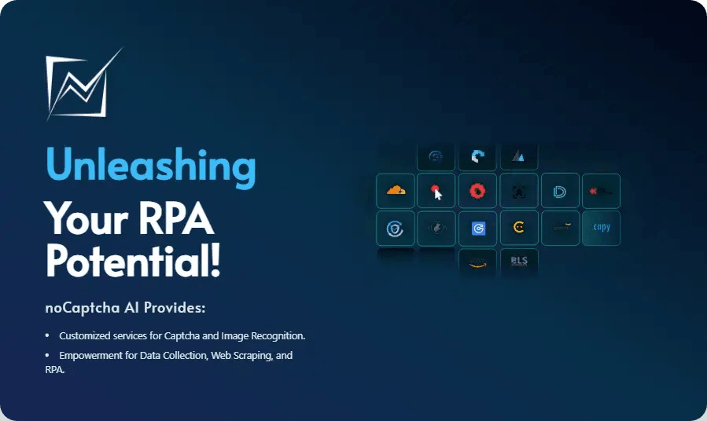

# 1.Introduction to noCAptcha AI:
NoCaptcha AI is an AI-powered service designed to automatically solve CAPTCHA challenges, including reCAPTCHA v2 (Image & Audio),BLS CAPTCHA, ImageToText OCR, and more. It offers browser extensions compatible with Chrome and Firefox, enabling users to bypass CAPTCHAs effortlessly. GitHub/NoCaptcha AI

# 2. Setting Up Your noCaptcha AI Account:

 Step 1: Visit the NoCaptcha AI Dashboard then tap on Sign up to create your account
for free.

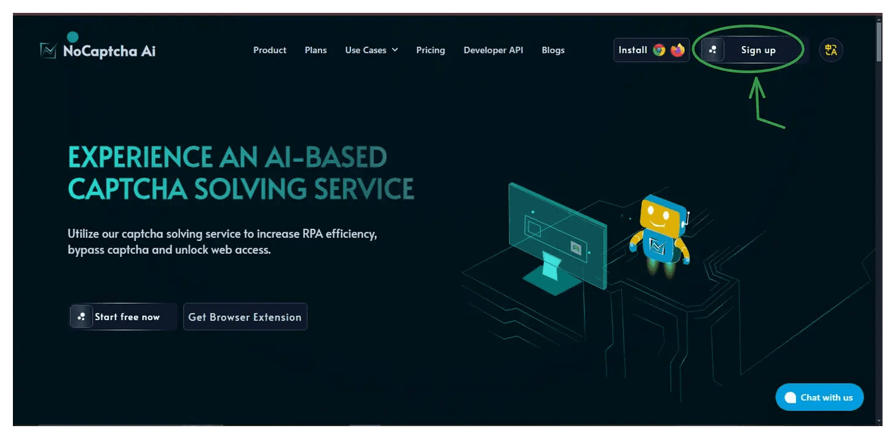

 Step 2: Log in to your account now to obtain your unique API key by clicking the image below.

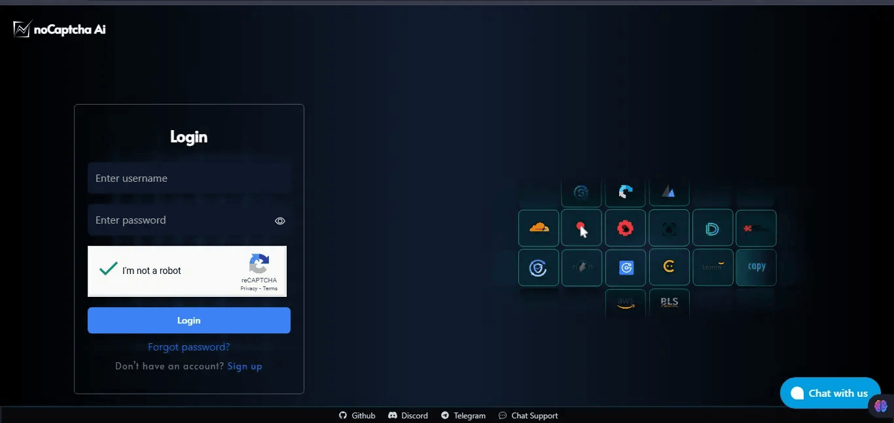

 Step 3: Copy the API key provided in your dashboard.

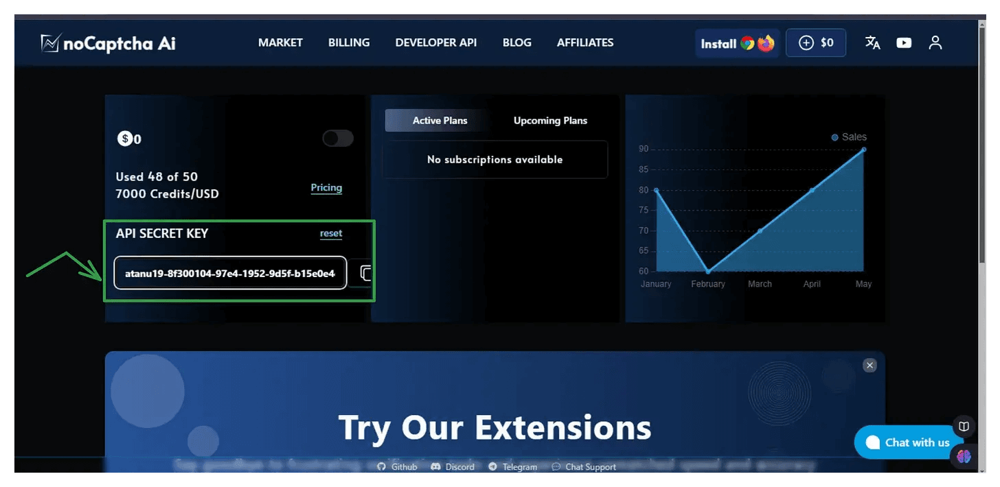

# 3. Installing the NoCaptcha AI Browser Extension file:
 # For Chrome Users:

Step 1: Visit the NoCaptcha AI Chrome Extension GitHub page directly, or you can click the below image to dirrectly get access to the official NoCaptcha AI GitHub browser extension page then scroll down for release section and click on it:

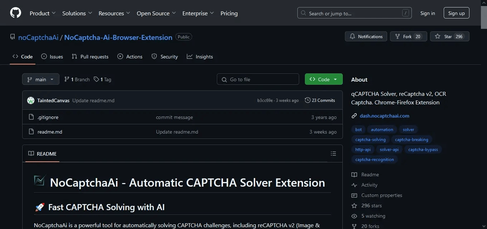

Step 2: Download the latest CRX/ZIP file from the releases section,you can see the latest version of the extension release v1.0.0 , next scroll down for the Assets section and select you preferred file:

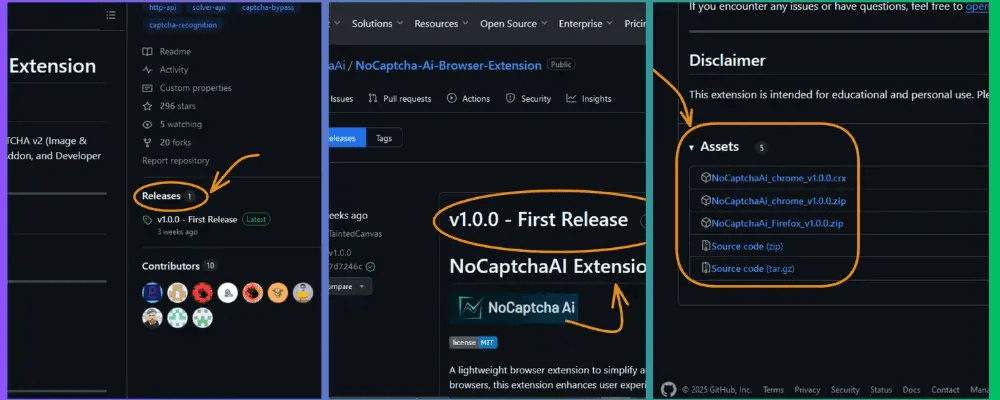

Step 3: Open your Chrome browser and navigate to chrome://extensions. Click on the customization option located in the top right corner. This action will unveil a settings sidebar; select Extensions and then proceed to click on Manage Extensions to access the Extension Window, as demonstrated in the accompanying image below.

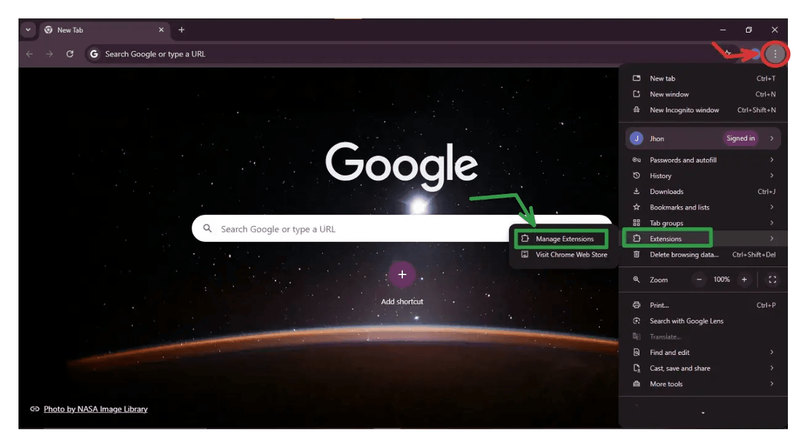

Step 4: Enable “Developer Mode“ by toggling the switch in the top right corner.

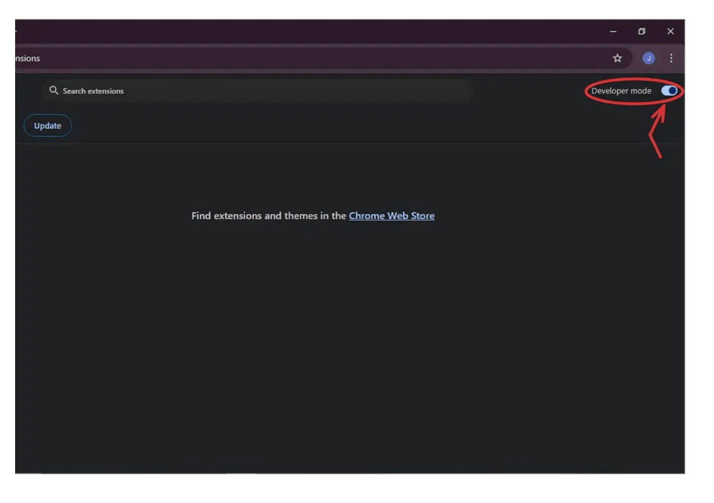

Step 5: Then from the Downloads folder double click on the downloaded CRX/ZIP file for the further process.

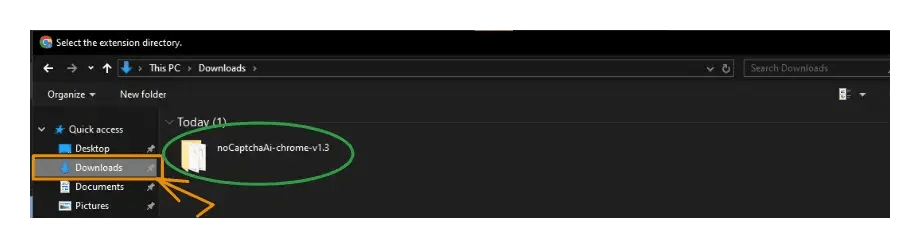

Step 6: After opening the folder, select the "Assets" folder from the available subfolders.

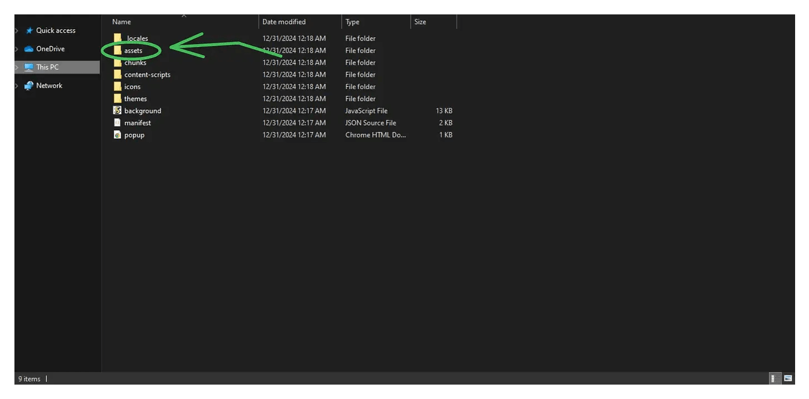

Step 7: After selecting the appropriate folder, you will see numerous files. Choose the default config file to hardcode your API key.

{/*  */}

Step 8: Click on the defaultconfig file to open it in your default code editor, or use Notepad if needed. Here, we are using VS Code. You'll notice the API key field is blank. Copy your API key from the No Captcha AI dashboard, paste it in that field as your default API key, and save the changes. Then, return to your folder.

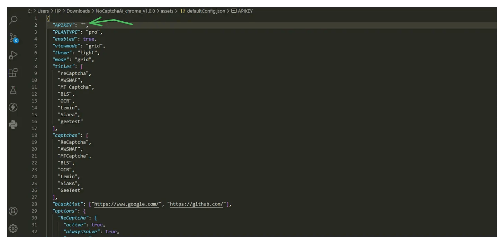

Step 9: Then next you just need to open your chrome browser extension page and simply drag&drop the edited file:

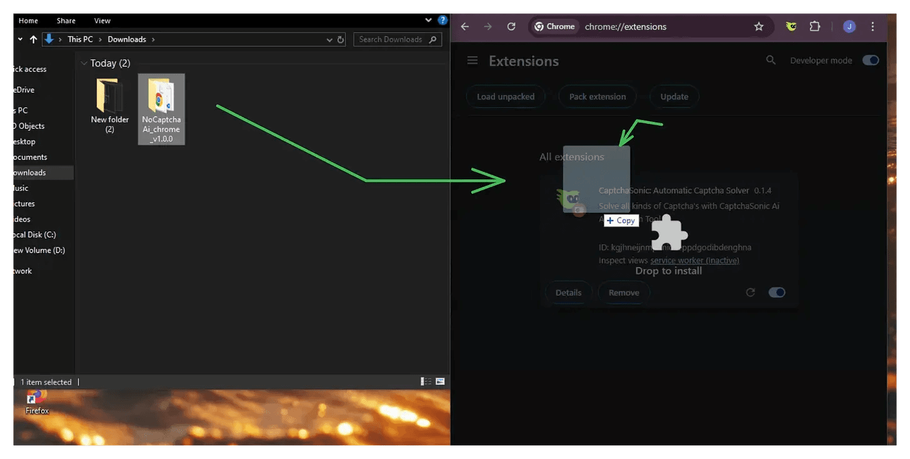

Step 10: Then as you can see in the below image your extension should be loaded:

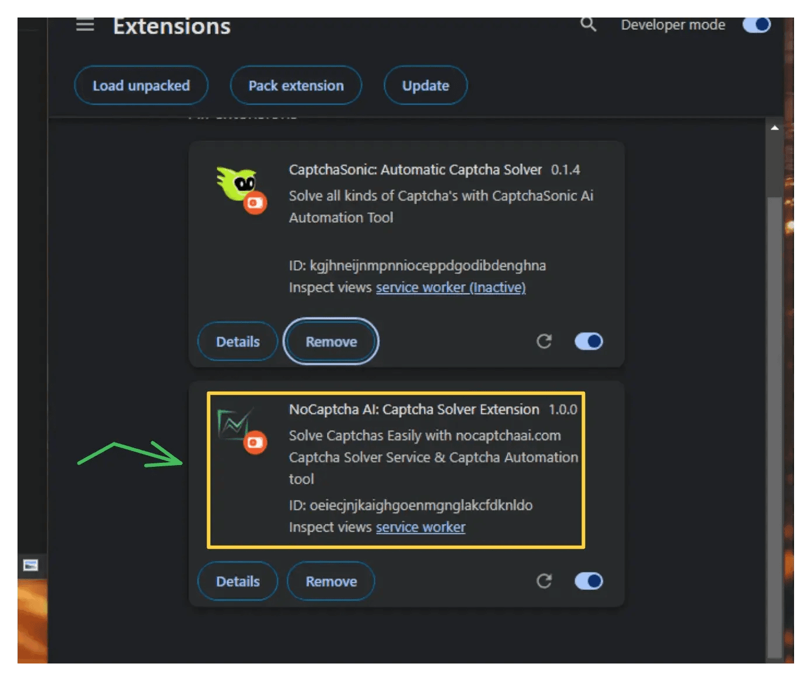

# For Firefox Users:

....comming soon....

{/* Step 1: Visit the NoCaptcha AI GitHub repository, or else you can get access from the dashboard by clicking on the firefox logo:

Step 2: Get the latest Firefox addon from the NoCaptcha AI GitHub repository by clicking the image below:

Step 3: Next Scroll down for the release section and click on release option for the latest v1.0.0 version then scroll down again for the assets section to download the firefox extension file:

Step 4: Open Firefox and navigate to the right top corner and tap on three dot menu bar then click on Add-on and themes.

Step 5: Click on the gear icon and select “Install Add-on From File”.

Step 6: Select the downloaded Addon file to complete the installation, following the same process as you did for Chrome.

# 4. Configuring the Extension:
Step 1: Click on the noCaptcha AI extension icon in your browser’s toolbar.

Step 2: Paste your API key into the designated field within the extension settings.

Step 3: Adjust any additional settings as per your preferences, such as enabling or disabling specific CAPTCHA types.

# 5. Using the Extension:
Once configured, the noCaptcha AI extension will automatically detect and solve supported CAPTCHA challenges as you browse.

When a CAPTCHA is encountered, the extension will process it in the background, allowing you to continue without interruption.

# 6. Managing your Account and Usage:
Log in to your noCaptcha AI Dashboard—

https://nocaptchaai.com

to monitor your usage statistics and manage your subscription plan.

The free plan offers 6000 solves per month, with options to upgrade for higher usage needs.

# 7. Troubleshooting and Support:
If you encounter any issues, refer to the NoCaptcha AI Documentation for detailed guides and FAQs.

For further assistance, join NoCaptcha AI Community on GitHub to connect with other users and developers.

# 8. Conclusion:
By following this guide, you can enhance your browsing experience with the noCaptcha AI browser extension, effectively bypassing CAPTCHA challenges effortlessly. Stay updated with the latest features and improvements by regularly checking the official NoCaptcha AI website.

References:
You can also go through our detailed articles on:

Effortlessly Bypass CAPTCHAs with noCaptcha Ai.

Bypassing reCAPTCHA with Playwright and NoCaptchaAi in Python.

Unlocking the Web with CaptchaSonic: A Comprehensive Review. */}