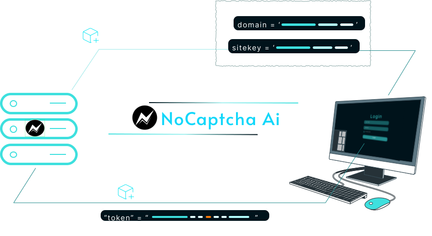

import GroupName from "../../../components/GroupName.astro";
import { Card, CardGrid } from "../../../components/components";
import {
  Icon,
  LinkCard,
  LinkButton,
  Aside,
} from "@astrojs/starlight/components";
import CustomCard from "../../../components/CustomCard.astro";
import { Steps } from '@astrojs/starlight/components';
import GlassButton from "../../../components/GlassButton.astro"; // Adjust path if needed
import AvailableSolutions from "../../../components/AvailableSolutions.astro";

<GroupName>Getting Started with NoCaptchaAi Services</GroupName>

### NoCaptchaAi : Your AI-Powered Captcha Solver
NoCaptchaAi is an AI-powered captcha solving service that helps you automate the process of solving captchas, making it easier to access and interact with websites that use these security measures. Whether you're a developer looking to integrate captcha solving into your applications or a user seeking a more efficient way to bypass captchas, NoCaptchaAi has you covered.

## Start Solving Now!

<Steps>
0. Browser Extension Method

   

    
To get started with NoCaptchaAi, you can use our browser extension for Chrome or Firefox. You need APIKEY `step: 1` to use.

     
     <GlassButton
    icon="rocket"
    class='w-full flex flex-row gap-2 align-center'
    iconPlacement="end"
    target="_blank"
    href="https://chromewebstore.google.com/detail/nocaptcha-ai-auto-captcha/hbnbcapieoandchfgacedlkjpdbbejgb?hl=en&utm_source=docs"
    variant="primary"
    >
    Download Chrome Extension
    </GlassButton>
     <GlassButton
    icon="seti:firefox"
    iconPlacement="end"
     class='w-full flex flex-row gap-2 align-center'
    target="_blank"
    href="https://addons.mozilla.org/en-US/firefox/addon/nocaptcha-ai-captcha-solver/?hl=en&utm_source=docs"
    variant="primary"
    >
    Download Firefox Extension
    </GlassButton>
    <GlassButton
    icon="github"
    iconPlacement="end"
     class='w-full flex flex-row gap-2 align-center'
    target="_blank"
    href="https://github.com/noCaptchaAi/NoCaptcha-Ai-Browser-Extension?hl=en&utm_source=docs"
    variant="primary"
    >
    Download Extension Github
    </GlassButton>
   

1. Create an Account

   
To start using NoCaptchaAi, you need to create an account. It's quick and easy!

   
Please visit ➡️ <a href="https://dash.nocaptchaai.com" target="_blank" rel="noopener noreferrer">
    "https://dash.nocaptchaai.com" <Icon name="external-link" class="inline" />
    </a> and create your free account.

    
      
2. Start Solving with API SDK
    

    <AvailableSolutions />

    

3. Join Community and Get Support
   <LinkCard title="Join Discord 🔥"    target="_blank" href="https://discord.com/invite/E7FfzhZqzA" />
   <LinkCard title="Join Telegram 🔥"    target="_blank" href="https://t.me/noCaptchaAi" />
   <LinkCard title="Telegram Support 🔥"    target="_blank" href="https://t.me/ai_v9" />
   <LinkCard title="Email Support 🔥"    target="_blank" href="mailto:ai@nocaptchaai.com" />

</Steps>

