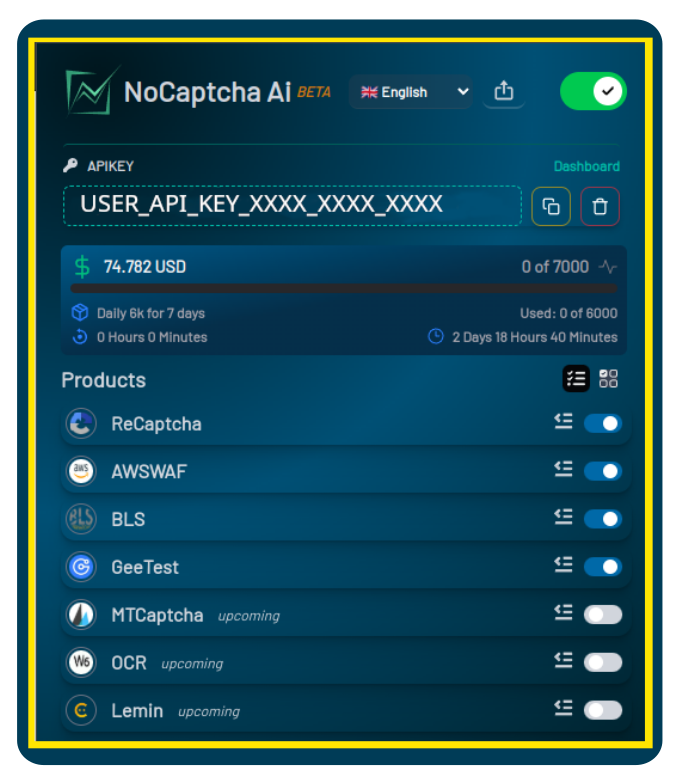

import GroupName from "../../../components/GroupName.astro";
import { Aside } from "@astrojs/starlight/components";
import { Steps } from "@astrojs/starlight/components";
import { Icon, LinkCard, LinkButton } from "@astrojs/starlight/components";

<GroupName>Getting Started</GroupName>

# Quickstart with NoCaptchaAi Extension

Start building awesome automation with NoCaptchaAi in under 5 minutes.

<Steps>

1. Starmint is a Starlight plugin that you can install using your favorite package manager:

   <LinkCard
   target="_blank"
     title="Download Browser Extension ☁️"
     href="https://nocaptchaai.com/extension"
   />

2. Configure the plugin in your Starlight configuration in the astro.config.mjs file.

   <LinkCard 
      target="_blank"
   title="Get Free APIKEY 👋" href="https://dash.nocaptchaai.com" />

3. Paste APIKEY on the extension

   

4. Start the development server to preview the theme in action.

   🏆 Congratulations, you are ready to solving captchas with NoCaptchaAi.

5. Join our community for support and updates:
   <LinkCard title="Join Discord 🔥"    target="_blank" href="https://discord.com/invite/E7FfzhZqzA" />
   <LinkCard title="Join Telegram 🔥"    target="_blank" href="https://t.me/noCaptchaAi" />
   <LinkCard title="Email Support 🔥"    target="_blank" href="mailto:ai@nocaptchaai.com" />
</Steps>
